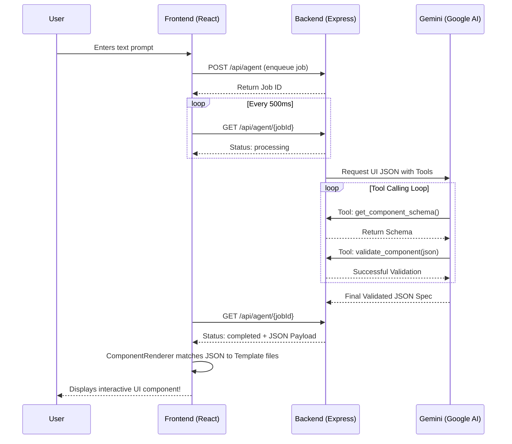

# AI UI Generator: Prompt to UI Architecture Flow

This document provides a simple step-by-step overview of exactly what happens when you type a prompt into the application.

## High-Level Flow 🌊

**1. The User Prompt**
*   **Where:** You type a prompt (e.g., "Create a dashboard for user stats") in the `ChatPage.tsx` interface.
*   **Action:** The React frontend uses `ApiService.sendMessage()` to send an HTTP POST request containing your prompt to the Express Backend.

**2. The Backend Queue**
*   **Where:** The Express Server (`backend/server.js`) receives the request at `POST /api/agent`.
*   **Action:** It creates a Job ID, stores it in an in-memory queue (`jobQueue`), and immediately tells the frontend "Job Accepted."

**3. The AI Agent Loop**
*   **Where:** A background worker routine inside the backend processes the queue queue.
*   **Action:** It sends your prompt to Google's **Gemini API**.
*   **The Magic:** Gemini doesn't just guess; it's equipped with internal Tools:
    *   It calls `get_components` to see what UI components exist in your project.
    *   It calls `get_component_schema` to see exactly what props those components need.
    *   It generates a JSON UI specification and calls `validate_component` against a rigid Component Schema to ensure it won't crash the frontend.

**4. Frontend Delivery**
*   **Where:** The frontend has been continuously polling `GET /api/agent/:jobId`.
*   **Action:** Once Gemini finishes and validates the JSON, the backend marks the job as `completed` and attaches the JSON. The frontend downloads it.

**5. Rendering the UI**
*   **Where:** The React App (`TesterPage` or `ChatPage`).
*   **Action:** The frontend receives the JSON UI specification. The `ComponentRenderer` component reads the JSON, matches the `name` to your actual local React files (in `/src/templates`), recursively builds the component tree, and renders it directly on your screen.

---

## Simplified Technical Diagram

